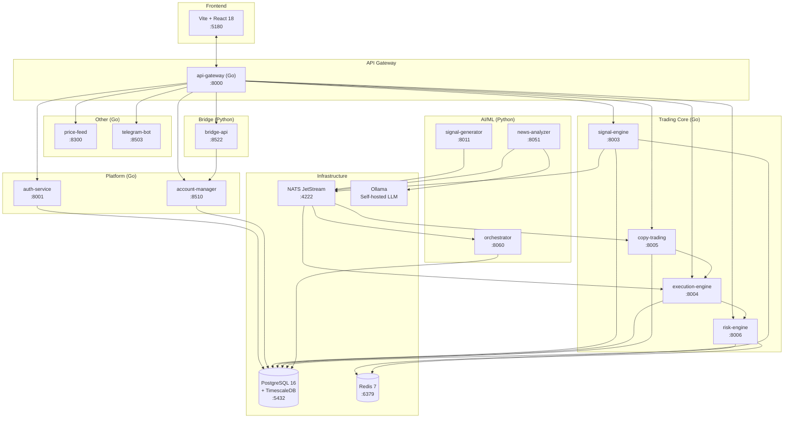
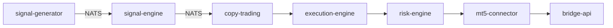

# Arquitectura TNSVT V2


**13 microservicios en producción** — Go + Python · Event-Driven · AI-Powered · Multi-Broker

[📄 Descargar PDF completo](TNSVT-V2-Architecture.pdf)

---

## System Architecture



## 13 Servicios en Producción

| # | Servicio | Puerto | Lenguaje | Estado |
|---|----------|--------|----------|--------|
| 1 | `api-gateway` | 8000 | Go | ✅ Running |
| 2 | `auth-service` | 8001 | Go | ✅ Running |
| 3 | `signal-engine` | 8003 | Go | ✅ Running |
| 4 | `execution-engine` | 8004 | Go | ✅ Running |
| 5 | `copy-trading` | 8005 | Go | ✅ Running |
| 6 | `risk-engine` | 8006 | Go | ✅ Running |
| 7 | `mt5-connector` | 8007 | Go | ✅ Running |
| 8 | `signal-generator` | 8011 | Python | ✅ Running |
| 9 | `news-analyzer` | 8051 | Python | ✅ Running |
| 10 | `orchestrator` | 8060 | Python | ✅ Running |
| 11 | `price-feed` | 8300 | Go | ✅ Running |
| 12 | `telegram-bot-service` | 8503 | Go | ✅ Running |
| 13 | `bridge-api` | 8522 | Python | ✅ Running |
| 14 | `account-manager` | 8510 | Go | ✅ Running |

## E2E Pipeline



## Quick Start

```bash
docker-compose up -d
# → 13 servicios en http://localhost:8000
# → Login: admin@tnsvt.local / Admin123!Demo
```

---

## 📚 Documentos de Arquitectura

### Visión y Estrategia
1. **[00-VISION.md](00-VISION.md)** — Resumen ejecutivo, problemática actual, propuesta de valor, pilares arquitectónicos, stack tecnológico
2. **[12-ROADMAP.md](12-ROADMAP.md)** — 4 fases de implementación (MVP → Enterprise, 36 meses)
3. **[13-RISKS.md](13-RISKS.md)** — 22 riesgos con matriz probabilidad/impacto + mitigaciones

### Arquitectura Técnica
4. **[01-ARCHITECTURE-OVERVIEW.md](01-ARCHITECTURE-OVERVIEW.md)** — Diagrama de alto nivel, Clean Architecture, DDD Bounded Contexts
5. **[02-SERVICES-CATALOG.md](02-SERVICES-CATALOG.md)** — Catálogo de 48 microservicios (descripción, lenguaje, puerto, SLA)
6. **[03-DATA-FLOWS.md](03-DATA-FLOWS.md)** — 8 flujos completos de datos con diagramas
7. **[04-DATA-MODEL.md](04-DATA-MODEL.md)** — Modelo de datos PostgreSQL + TimescaleDB + Event Sourcing

### Comunicación y Seguridad
8. **[05-COMMUNICATION.md](05-COMMUNICATION.md)** — NATS subjects, CloudEvents, sagas, retry, DLQ
9. **[06-SECURITY.md](06-SECURITY.md)** — Zero Trust, OAuth2, RBAC (12 roles), WAF, encryption, audit

### Infraestructura y Operaciones
10. **[07-INFRASTRUCTURE.md](07-INFRASTRUCTURE.md)** — Docker Compose, Kubernetes, Traefik, CI/CD, blue-green
11. **[08-OBSERVABILITY.md](08-OBSERVABILITY.md)** — OpenTelemetry, Prometheus, Grafana, Loki, Tempo, SLOs
12. **[09-RESILIENCE.md](09-RESILIENCE.md)** — Circuit breakers, bulkheads, DR plan, RTO/RPO

### Inteligencia Artificial y UX
13. **[10-AI-CORE.md](10-AI-CORE.md)** — AI Core completo: Ollama, regime detection, signal scoring, RAG, LLM agent
14. **[11-UX-DESIGN.md](11-UX-DESIGN.md)** — 5 paneles de usuario + wireframes + Tauri desktop
15. **[14-SCALE-100K.md](14-SCALE-100K.md)** — Estrategia para 100K usuarios concurrentes

---

## 📦 Formatos Disponibles

Cada documento está disponible en 3 formatos:

- **Markdown** (`docs/*.md`) — Para devs, control de versiones, búsqueda
- **Word** (`../word/*.docx`) — Para editar, colaborar, comentarios
- **PDF** (`../pdf/*.pdf`) — Para presentar, imprimir, distribuir

## 🚀 Por Dónde Empezar

**Si tienes 5 minutos**: Lee [00-VISION.md](00-VISION.md)

**Si tienes 30 minutos**: Lee 00 → 01 → 02 → 12 (Roadmap)

**Si tienes 2 horas**: Lee todo en orden

**Si quieres implementar**: Lee 02 → 03 → 04 → 05 → 07

## 📊 Estadísticas

- **Total de páginas**: ~120 páginas (PDF)
- **Tamaño total**: ~3 MB (3 formatos)
- **Idioma**: Español
- **Última actualización**: Julio 2026

---

*"No estamos construyendo un bot de trading. Estamos construyendo la plataforma de trading algorítmico más completa de Latinoamérica."*