# Executive Summary

TNSVT V2 es una **plataforma SaaS de trading algorítmico** de nivel empresarial
que integra un motor de señales multi-broker, copy trading 1:N configurable por
cuenta, inteligencia artificial autoalojada (Ollama), y un framework de riesgo en
tiempo real — todo sobre una arquitectura orientada a eventos con NATS JetStream.

**13 microservicios en producción** escritos en Go y Python, desplegables con un
solo `docker-compose up`, desde un solo servidor hasta un cluster Kubernetes HA.

---

# Table of Contents

- [Executive Summary](#executive-summary)
- [Problem & Vision](#problem--vision)
- [Architecture Overview](#architecture-overview)
- [Services Catalog](#services-catalog)
- [Data Flows](#data-flows)
- [Infrastructure & Deployment](#infrastructure--deployment)
- [AI & Machine Learning](#ai--machine-learning)
- [Observability & Resilience](#observability--resilience)
- [Security](#security)
- [Roadmap](#roadmap)
- [Appendix: Screenshots](#appendix-screenshots)

---

# Problem & Vision

## Current Limitations (V1)

| Dimensión | V1 (Legacy) | V2 (Objetivo) |
|-----------|------------|---------------|
| Stack | PHP Symfony monolítico + FastAPI aislado | Go microservicios + Python AI/ML |
| Mensajería | Sin bus centralizado | NATS JetStream event sourcing |
| Base de datos | SQLite (sin escalabilidad) | PostgreSQL + TimescaleDB |
| Usuarios concurrentes | ~50 | 100,000+ |
| Brokers | 1 (MT5) | 5+ (MT5, cTrader, Binance, Bybit, IBKR) |
| Latencia de ejecución | 2-5 segundos | < 100ms (p99) |
| Copy trading | Rígido 1:1, sin configuración | 1:N configurable por cuenta |
| AI/ML | Sin AI productivo | Ollama self-hosted + RAG + scoring NLP |
| Observabilidad | Sin métricas | OpenTelemetry + Prometheus + Grafana |
| Despliegue | Manual, frágil | Docker Compose → Swarm → K8s |

## Pilares Arquitectónicos

1. **Event-Driven**: NATS JetStream como backbone de mensajería
2. **Desacoplamiento**: Cada servicio es independiente, desplegable y escalable
3. **AI-First**: Modelos de lenguaje autoalojados para scoring y análisis
4. **Multi-Tenancy**: Schema-per-tenant PostgreSQL desde el diseño
5. **Autoalojable**: Sin dependencias de APIs externas para operación core

---

# Architecture Overview

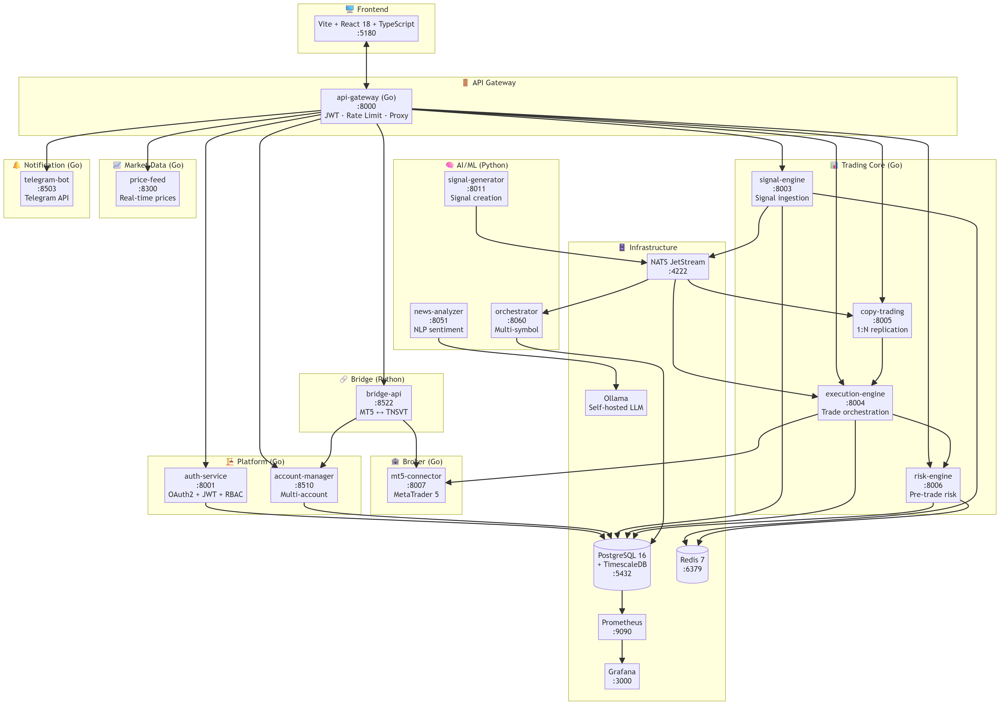

## Layer Architecture

```
┌─────────────────────────────────────────────────────────────┐
│                     Frontend (:5180)                        │
│             React 18 + TypeScript + Vite                    │
├─────────────────────────────────────────────────────────────┤
│                   API Gateway (:8000)                       │
│          JWT Validation · Rate Limiting · Proxy             │
├──────────┬──────────┬──────────┬──────────┬────────────────┤
│ Platform │  Trading │   AI     │  Market  │ Notification   │
│ :8001    │ :8003-7  │ :8011    │ :8300    │ :8503          │
│ :8510    │          │ :8060    │          │                │
│          │          │ :8051    │          │                │
├──────────┴──────────┴──────────┴──────────┴────────────────┤
│                    Bridge API (:8522)                       │
│                MT5 ↔ TNSVT Translation                      │
├─────────────────────────────────────────────────────────────┤
│                    Infrastructure                            │
│   PostgreSQL · Redis · NATS JetStream · Prometheus · Ollama │
└─────────────────────────────────────────────────────────────┘
```

## Technology Stack

| Component | Technology | Justification |
|-----------|-----------|---------------|
| Backend (Core) | Go 1.22+ | Concurrencia nativa, binarios estáticos, rendimiento predecible |
| Backend (AI/Bridge) | Python 3.12+ | Ecosistema ML/NLP (transformers, langchain) |
| Frontend | React 18 + Vite + TypeScript | CSR puro, despliegue CDN, sin SSR |
| Message Bus | NATS JetStream | Persistente, alta velocidad, clustering nativo |
| Database | PostgreSQL 16 + TimescaleDB | Relacional + series temporales |
| Cache | Redis 7 | Rate limiting, sesiones, señal dedup |
| AI | Ollama (self-hosted LLM) | Sin dependencia cloud, privacidad total |
| Monitoring | Prometheus + Grafana | Stack estándar open-source |
| Container | Docker + Docker Compose | Despliegue reproducible |

---

# Services Catalog

## Gateway

### api-gateway (:8000)

**Rol**: Proxy reverso, JWT validation, rate limiting, entry point único.

**Tech**: Go 1.22 + chi router + JWT middleware

**Routes**:
| Route | Service | Auth |
|-------|---------|------|
| `/api/v1/auth/*` | auth-service | No |
| `/api/v1/me` | auth-service | JWT |
| `/api/v1/signals/*` | signal-engine | JWT |
| `/api/v1/accounts/*` | account-manager | JWT |
| `/api/v1/copy/*` | copy-trading | JWT |
| `/api/v1/execute/*` | execution-engine | JWT |
| `/api/v1/risk/*` | risk-engine | JWT |
| `/api/v1/prices/*` | price-feed | JWT |
| `/api/v1/bridge/*` | bridge-api | JWT |
| `/api/v1/notify/*` | telegram-bot-service | API Key |
| `/api/v1/orchestrator/*` | orchestrator | JWT |

## Platform Services

### auth-service (:8001)

**Rol**: Autenticación OAuth2, JWT emisión/refresh, RBAC, gestión de usuarios.

**Endpoints**:
- `POST /api/v1/auth/login` — Email + password → JWT pair
- `POST /api/v1/auth/refresh` — Refresh token → new JWT pair
- `GET /api/v1/auth/me` — Current user profile + permissions
- `POST /api/v1/auth/logout` — Invalidate session
- `GET /api/v1/auth/users` — List users (admin)
- `POST /api/v1/auth/users` — Create user (admin)

**DB**: `users`, `roles`, `permissions`, `refresh_tokens`

### account-manager (:8510)

**Rol**: Gestión de cuentas MT5 multi-broker, vinculación bridge.

**Endpoints**:
- `GET /api/v1/accounts` — List accounts
- `POST /api/v1/accounts` — Register account
- `GET /api/v1/accounts/{id}` — Account details

## Trading Core

### signal-engine (:8003)

**Rol**: Ingesta, validación, deduplicación y almacenamiento de señales.

**Flujo**:
1. Recibe señal (NATS o HTTP)
2. Valida formato y broker
3. Deduplica por symbol+timestamp
4. Almacena en PostgreSQL
5. Publica en NATS `trading.signal.validated`

### execution-engine (:8004)

**Rol**: Orquestación de ejecución de órdenes con retry y backoff.

**Endpoints**:
- `POST /api/v1/execute` — Execute order (with risk check)
- `GET /api/v1/execute/{id}` — Order status
- `GET /api/v1/execute` — List orders

**Resiliencia**: 2 retries, 30s timeout, circuit breaker per broker

### copy-trading (:8005)

**Rol**: Replicación 1:N de señales a múltiples cuentas.

**Capacidades**:
- Matching por grupos predefinidos
- Escalado de lote por cuenta
- Filtros por símbolo, riesgo, horario
- Creación de CopyJob por cada order

### risk-engine (:8006)

**Rol**: Pre-trade risk validation en tiempo real.

**Checks**:
- Max drawdown (< 15%)
- Max open positions (< 3)
- Per-symbol exposure limits
- Account-level daily loss limit

## AI / ML

### signal-generator (:8011)

**Rol**: Generación programática de señales basada en reglas y data de mercado.

### orchestrator (:8060)

**Rol**: Orquestación multi-symbol de señales generadas por AI.

### news-analyzer (:8051)

**Rol**: Análisis NLP de noticias financieras vía Ollama.

**Flujo**: Fetch news → Ollama LLM analysis → Sentiment score → NATS signal

## Market Data

### price-feed (:8300)

**Rol**: Streaming de precios en tiempo real desde múltiples fuentes.

**WebSocket**: Actualizaciones sub-second de bids/asks

## Notification

### telegram-bot-service (:8503)

**Rol**: Proxy de notificaciones a Telegram con soporte multi-chat.

**Endpoints**:
- `GET /api/v1/notify/health` — Health check (proxy-aware)
- `POST /api/v1/notify/send` — Send message to chat

## Bridge

### bridge-api (:8522)

**Rol**: Traductor MT5 ↔ TNSVT, sincronización de cuentas y señales.

**Flujo**:
1. MT5 Bot envía señal → bridge-api
2. bridge-api enruta a signal-engine
3. bridge-api consulta account-manager para mapping
4. bridge-api envía órdenes a MT5

## Broker

### mt5-connector (:8007)

**Rol**: Conexión nativa con MetaTrader 5, envío de órdenes vía API.

---

# Data Flows

## End-to-End Signal Pipeline

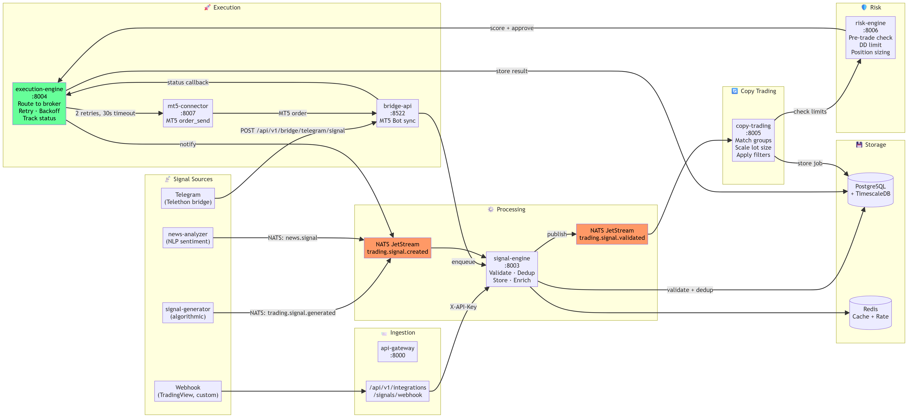

### Flow completo:

1. **Source**: Una señal llega desde signal-generator (algorítmico), webhook
   (TradingView), Telegram bridge, o news-analyzer (NLP)
2. **Ingestion**: api-gateway recibe y reenvía a signal-engine
3. **Validation**: signal-engine valida formato, simbolo, deduplica
4. **Distribution**: Publica en NATS `trading.signal.validated`
5. **Copy Trading**: copy-trading consume, escala lotes, crea CopyJob
6. **Risk Check**: risk-engine valida drawdown, posiciones, exposición
7. **Execution**: execution-engine envía a broker con retry+backoff
8. **Broker**: mt5-connector ejecuta en MT5 y retorna status

### Tiempos (benchmark):

| Etapa | Latencia esperada |
|-------|------------------|
| signal → NATS | < 5ms |
| NATS → signal-engine | < 10ms |
| copy-trading | < 50ms |
| risk-engine | < 30ms |
| execution-engine → broker | < 100ms |
| **Total (p99)** | **< 200ms** |

## Service Dependencies


## Key Data Flows

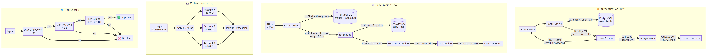

### Authentication Flow

```
User → POST /login → api-gateway → auth-service → PostgreSQL → JWT tokens
User → API call + Bearer JWT → api-gateway → validate JWT → route to service
```

### Copy Trading 1:N

```
1 Signal (EURUSD BUY) → Match Groups → Account A (lot=0.01)
                                    → Account B (lot=0.02)
                                    → Account C (lot=0.01)
                                    → Parallel Execution
```

### Risk Gate Flow

```
Signal → Max Drawdown < 15%? → Max Positions < 3? → Per-Symbol Exposure OK? → Approved
                                                                               ↓
                                                                           Blocked ❌
```

---

# Infrastructure & Deployment

## Container Architecture

Todos los servicios se despliegan como contenedores Docker:

```yaml
# docker-compose.yml (core)
services:
  nats:        image: nats:2.10   # JetStream enabled
  postgres:    image: postgres:16 # + timescaledb
  redis:       image: redis:7
  gateway:     build: apps/gateway/api-gateway
  auth:        build: apps/auth-service
  signal-gen:  build: apps/ai/signal-generator
  # ... 13 services total
```

## Ciclo de Vida de Señal

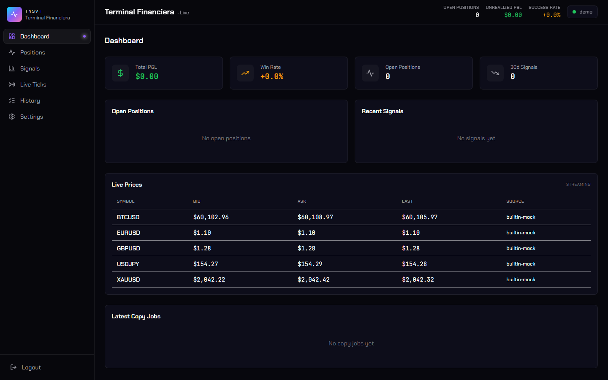

### Estados de un CopyJob

```
PENDING → ACTIVE → COMPLETED
              ↓
           FAILED (retry 2x)
              ↓
           FAILED (final)
```

## Credenciales

- **Admin Panel**: `http://localhost:8000`
- **Login**: `admin@tnsvt.local` / `Admin123!Demo`
- **PostgreSQL**: `localhost:5432` / `tnsvt` / `tnsvt_trading`
- **NATS**: `localhost:4222`
- **Redis**: `localhost:6379`

---

# AI & Machine Learning

## Ollama Integration

El modelo de lenguaje se ejecuta **self-hosted** vía Ollama, sin dependencia de
APIs externas. Esto garantiza:

- **Privacidad total**: datos de trading nunca salen de la infraestructura
- **Latencia controlada**: ~500ms por inferencia en GPU local
- **Costo predecible**: sin costos API por token
- **Offline-first**: opera sin conexión a internet

### news-analyzer Pipeline

```
News Article → Fetch HTML → Clean Text → Ollama LLM → Sentiment Score
                                                        (BUY/SELL/HOLD + confidence)
                                               ↓
                                        NATS: news.signal
                                               ↓
                                        signal-engine
```

## Modelos Utilizados

| Modelo | Propósito | Tamaño |
|--------|-----------|--------|
| Llama 3.1 8B | Análisis de sentimiento financiero | 4.7GB |
| Mistral 7B | Scoring de señales (fallback) | 4.1GB |

---

# Observability & Resilience

## Monitoring Stack

| Component | Rol | Puerto |
|-----------|-----|--------|
| Prometheus | Metrics collection | :9090 |
| Grafana | Visualization | :3000 |
| NATS JetStream | Event sourcing + persistence | :4222 |

## Resilience Patterns

### Retry with Exponential Backoff

Cada llamada a broker implementa:
- **Max retries**: 2
- **Timeout**: 30s
- **Backoff**: 1s, 5s (exponencial + jitter)

### Circuit Breaker

Si un broker falla 3 veces consecutivas, el circuito se abre por 60s.

### Graceful Degradation

- Si Ollama falla → fallback a scoring basado en reglas
- Si PostgreSQL falla → Redis cache como respaldo de solo lectura
- Si broker falla → cola de reintentos en NATS (no pérdida de orden)

---

# Security

## Authentication & Authorization

- **JWT**: Access token (15min) + Refresh token (7 días)
- **RBAC**: Roles `admin`, `trader`, `viewer` con permisos granulares
- **Rate limiting**: 100 req/min por IP, 1000 req/min por API key

## Network Security

- **Gateway como único entry point**: todos los servicios internos sin exposición
- **Proxy-aware**: telegram-bot-service detecta X-Forwarded-* headers
- **PostgreSQL**: autenticación md5, conexiones solo desde red interna Docker

## Data Protection

- **Passwords**: bcrypt (cost=12)
- **JWT Secrets**: 256-bit random, rotables
- **API Keys**: hasheadas en DB, prefix público para identificación

---

# Roadmap

| Fase | Q | Features |
|------|---|----------|
| **1** (Actual) | Q3 2026 | Core trading + copy + risk + bridge MT5 |
| **2** | Q3 2026 | Multi-broker (cTrader), WebSocket streaming, Grafana dashboards |
| **3** | Q4 2026 | Frontend React completo, Tauri desktop app, multi-tenancy |
| **4** | Q1 2027 | Scale to 100k users, Kubernetes HA, white-label |

## Phase 2 (Next)

- [ ] Multi-broker: cTrader connector
- [ ] WebSocket streaming bidireccional
- [ ] Grafana dashboards operacionales
- [ ] Sistema de alertas vía WebSocket
- [ ] Backtesting engine
- [ ] Smart Order Routing

---

# Appendix: Screenshots

## Dashboard — Trading Overview

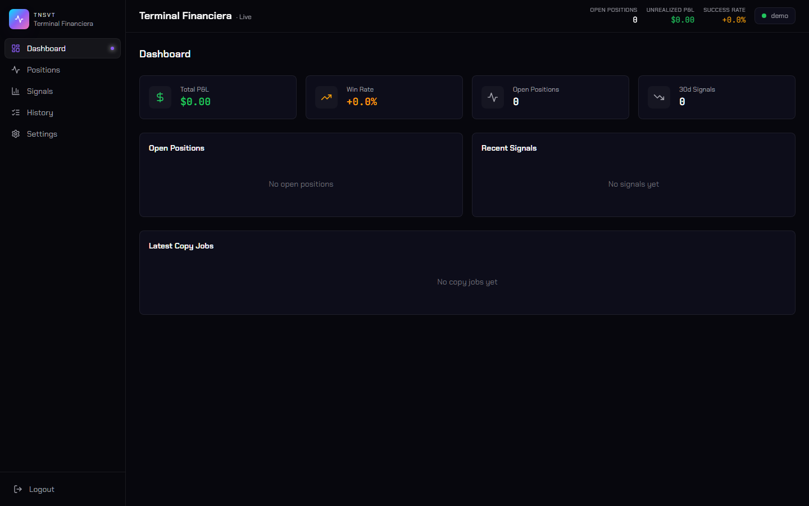

## Active Positions

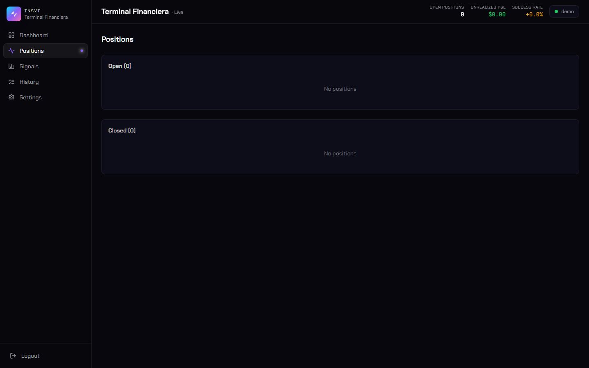

## Signal History

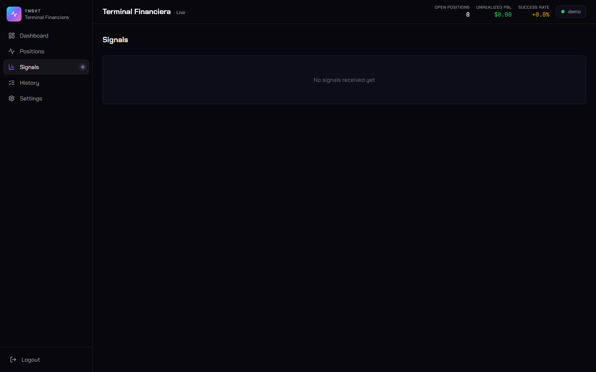

## Execution History

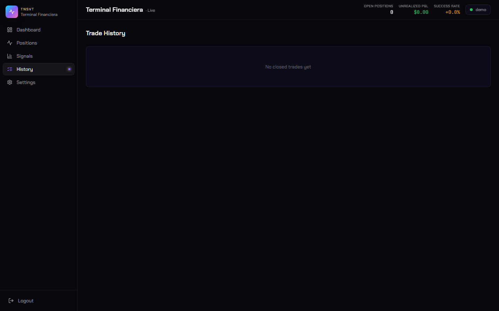

## Settings & Configuration

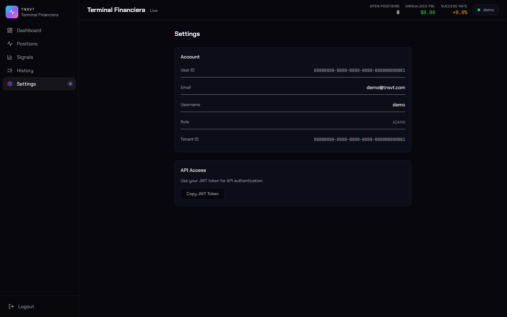

## Database Overview (Back office)


## Login Screen

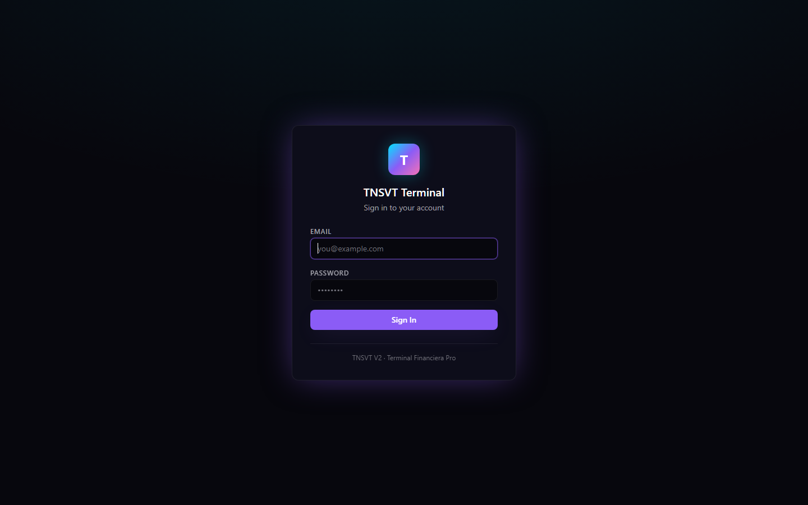

## Live Dashboard

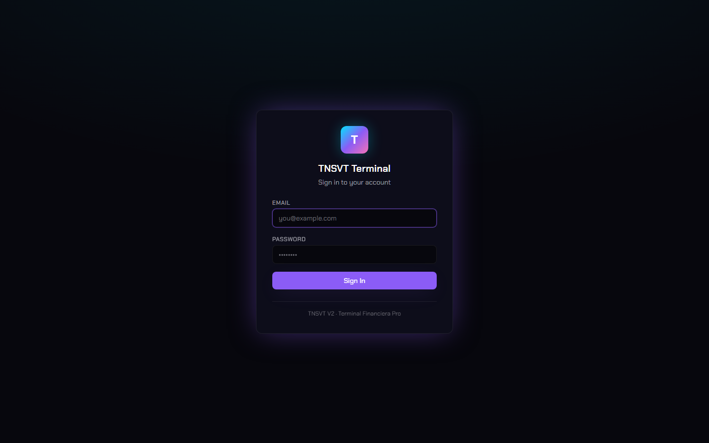

## Live Dashboard (Real-time)

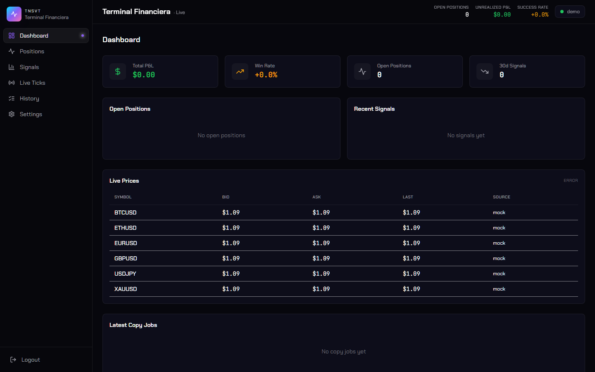

## Live Page

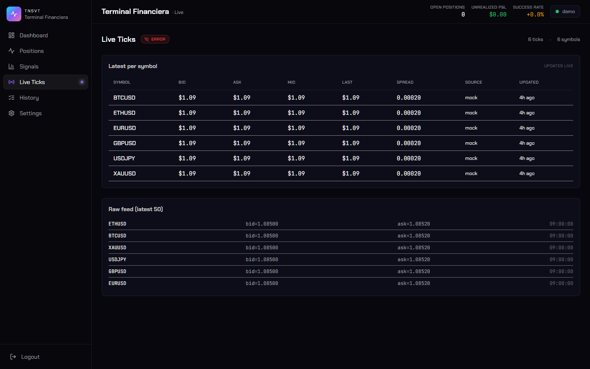

## E2E Pipeline — Live View


## E2E Pipeline — Final Live

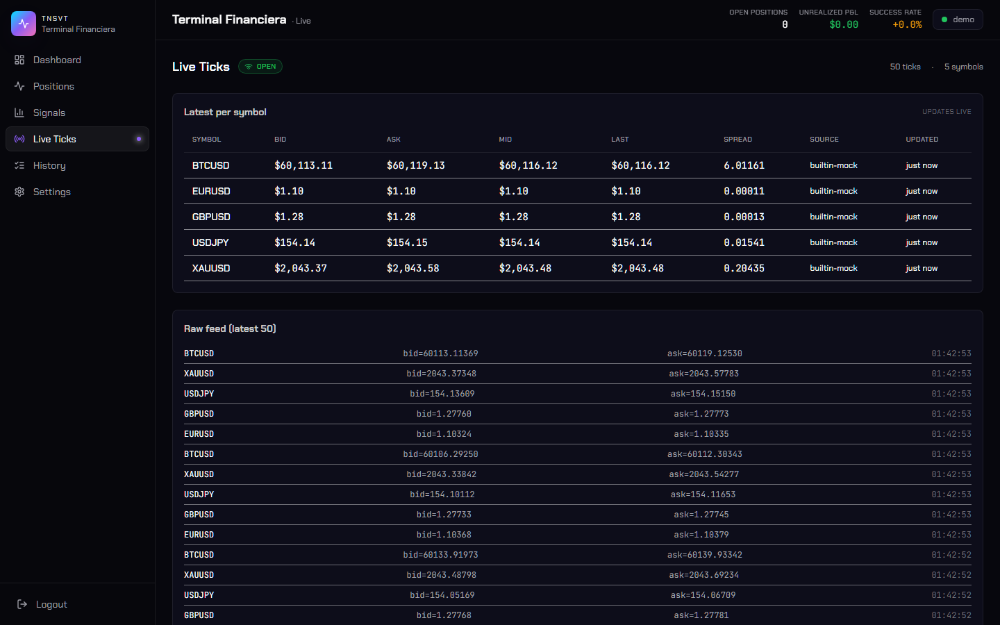

## E2E Final Dashboard


## E2E Dashboard Signals

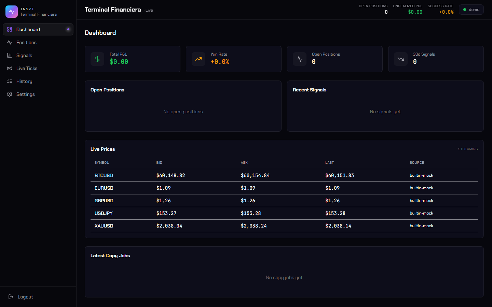

## Debug — Home Page

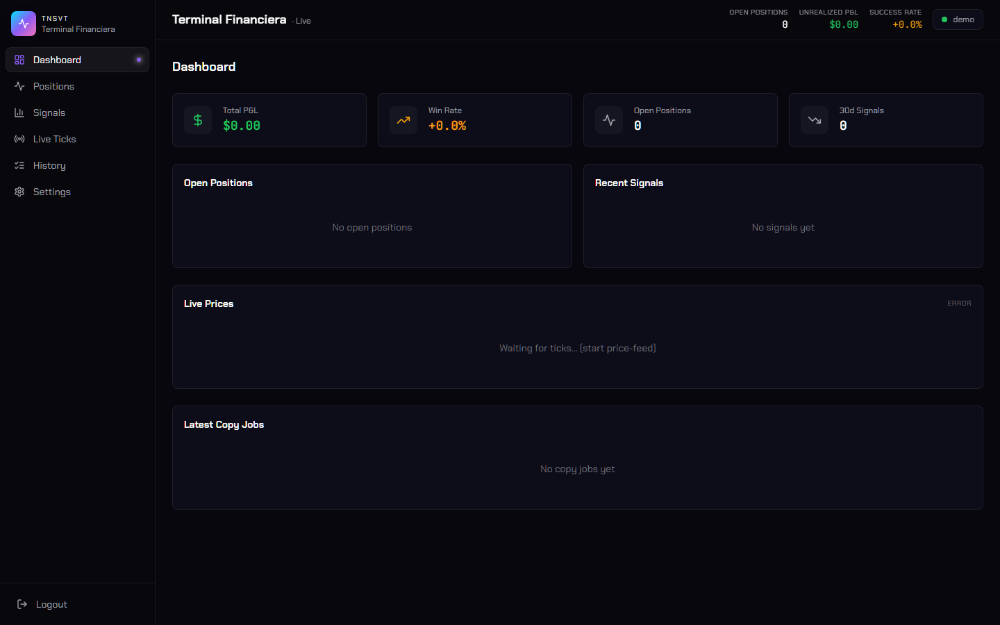
